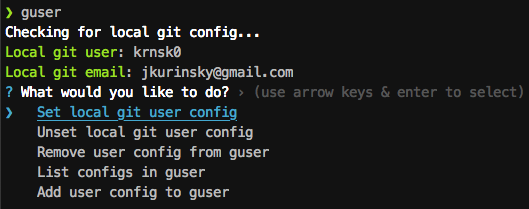

> Interactive git user switcher

```
   __ _ _   _ ___  ___ _ __
  / _` | | | / __|/ _ \ '__|
 | (_| | |_| \__ \  __/ |
  \__, |\__,_|___/\___|_|
  |___/
```


[](http://makeapullrequest.com)
[](https://opensource.org/licenses/MIT)

## What is this?

Do you manage multiple git users on a single machine? Do you often switch between work and personal git accounts and configure different repositories to use different accounts? `guser` is an interactive tool inspired by [WindomZ's `gituser`](https://github.com/WindomZ/gituser.js) that helps make git user-switching a tiny bit easier by remembering user/email combinations you've used in the past.



If you want the [unix philosophy](https://en.wikipedia.org/wiki/Unix_philosophy#:~:text=The%20Unix%20philosophy%20is%20documented,%2C%20as%20yet%20unknown%2C%20program.) version of this tool, go with [`gituser.js`](https://github.com/WindomZ/gituser.js), but if you like interactive input, choose `guser`: while this tool does one thing and does it well, it is not readily scriptable.

## Installation

Requires `node` 10.x, 12.x, or 14.x.

```bash
npm i -g guser
```

Configuration is saved in a dotfile in your home directory (`~/.guser`).

## Usage

You'll of course need a working version of `git` in your path.

To start:

```bash
guser
```

The chosen user/email config is set in the repository corresponding to the current working directory, so you'll need to be inside a repo in order to configure it to use one of your stored configs. `guser` works by shelling out to [`git config`](https://git-scm.com/docs/git-config) to edit the `config` file stored in the `.git` directory of the repository.

You likely set a username and email via `git config` when setting up git for the first time. This is stored in a configuration file in your user directory. `guser` checks for a local config on startup when invoked inside a repository and prints the user and email (if found) to the console. If no username and email are set via the config file local to a repository, `git` defaults to user/email values set in the global config file, if any, when committing staged changes.
